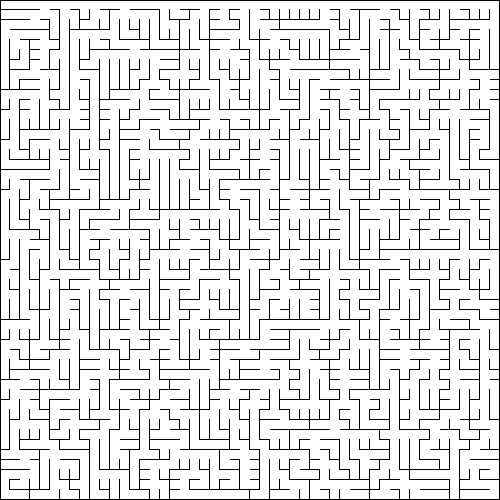

# Maze generation in Go

Code I wrote while going through the book
[Mazes for Programmers: Code Your Own Twisty Little Passages](https://pragprog.com/titles/jbmaze/mazes-for-programmers/).
The algorithms and datastructures in the book are written in ruby. I chose to do the exercises in go.

**Disclaimer:** I have no significant previous experience with go besides some experimenting now and then. While I try to adhere to best practices, I have no doubt that I made plenty of mistakes. I'm also trying to balance writing good code with actualy finishing the book.

## Set up

Executing

```bash
go run .
```

runs the `hello.go` demo script. This will output a generated maze on your terminal, and create a png file with the same maze.

## Examples


